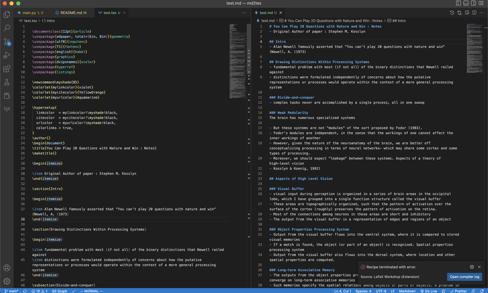
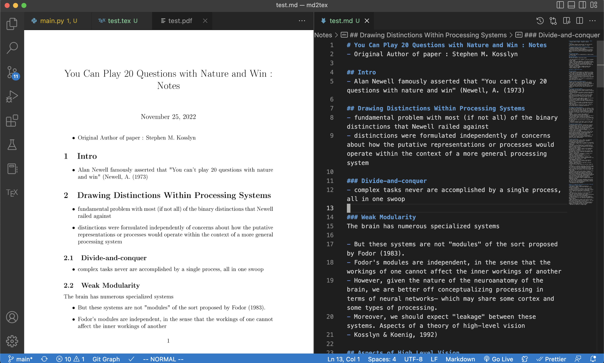

# md2tex
- Convert markdown to latex (mostly)

## Demo
- 
- 
## How to Use
- Write your document in any markdown editor of your choice
- Make sure you only have 1 heading though. (aka 1 single # not ## , ### etc)
- Every other level of # (eg: ##, ### etc) are treated as nested sections

### Just conversion
- python3 main.py -f <path_to_file>
- eg:
    - python3 main.py -f /Users/eragon/Obsidian/AI-knowledge-base/docs/images/Pasted image 20220502161821.png
### Add basic latex template
- Just want your article done quick and dirty? Enable the default template with a single flag.
- python3 main.py -f <path_to_file> -d

## Supported features
- Headings
- Nested sections
- Sub/subsub sections
- Math
- Code blocks
- Lists : With/Without enumeration
- Images

## Todo
- Links
